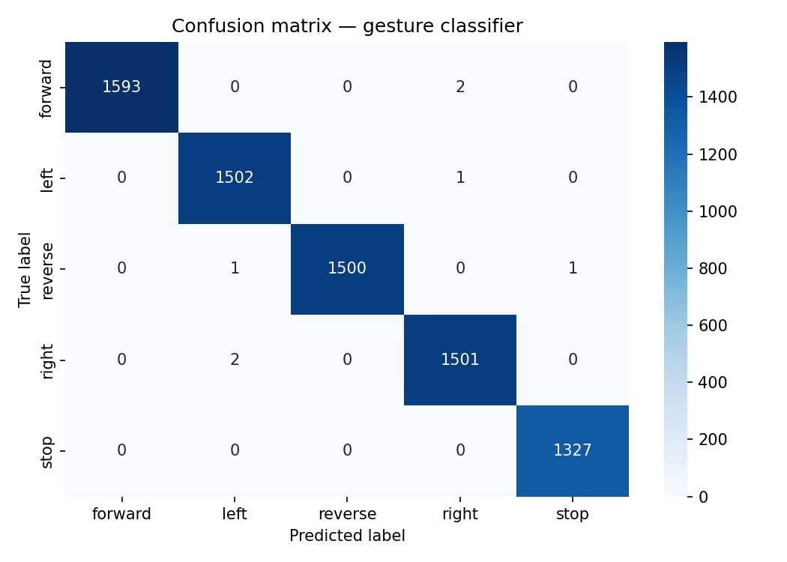

<div align="center">

# Gesture RC Car

Control a real RC car with hand gestures through your phone — no app, no laptop, no wearables.

<br/>

[](https://yash-patil-26.github.io/Gesture_car/)
&nbsp;
[](LICENSE)

<br/>

https://github.com/yash-patil-26/Gesture_Car/assets/YOUR_USER_ID/demo.mp4

</div>

---

## What this is

Open [yash-patil-26.github.io/Gesture_car](https://yash-patil-26.github.io/Gesture_car/) on any phone.
The browser downloads a trained ML model, activates your front camera, and classifies hand gestures locally — no frames ever leave your device. Recognised gestures are published as command strings to a cloud MQTT broker. An ESP8266 on the car subscribes to the same topic and drives the motors.

Close the tab. The car stops.

---

## Gestures

| Gesture | Command |
|:---:|:---|
| ✋ Open palm | Forward |
| ✊ Closed fist | Stop |
| 🤘 Rock (index + pinky) | Left |
| 👌 OK | Right |
| 👎 Dislike | Reverse |

---

## System design

Phone browser Cloud Car
───────────────────── ────────────── ──────────────────
MediaPipe (landmarks) → HiveMQ wss://8884 → ESP8266 NodeMCU
ONNX Random Forest → gesturecar/command → L298N motor driver
<5ms inference ~80ms relay 4× TT motors


**Why MQTT over direct WebSocket:** Browsers served over HTTPS block unencrypted `ws://` connections. The ESP8266 cannot run TLS. A cloud broker with `wss://` on the browser side and plain TCP on the car side solves this permanently.

**Why Random Forest:** The 21 landmark coordinates are already a high-level representation. A tree-based classifier generalises well at this scale, gives calibrated probabilities for confidence gating, and runs in under 1ms.

---

## ML model

| | |
|---|---|
| Input | 63 floats — 21 landmarks × (x,y,z), wrist-normalised, scale-normalised |
| Algorithm | Random Forest, 100 trees |
| Training data | ~25,000 samples — filtered images + webcam collection |
| Cross-validation accuracy | 97–99% |
| Inference | <1ms Python · ~5ms ONNX WASM in browser |
| Format | ONNX opset 12, served via GitHub Pages |

<details>
<summary>Confusion matrix</summary>
<br/>

</details>

---

## Hardware

| Part | Role |
|---|---|
| ESP8266 NodeMCU | WiFi client + MQTT subscriber + motor logic |
| L298N motor driver | H-bridge, drives left and right motor pairs |
| 4× TT motors + 2× 18650 (7.4V series) | Propulsion and power |
| Acrylic chassis 200×160mm | Structure |

**Wiring:** D1→IN1, D2→IN2, D5→IN3, D6→IN4, D7→ENA (PWM), D8→ENB (PWM). Remove ENA/ENB jumpers before connecting D7/D8.

---

## Quick start

**Requirements:** Python 3.9+, Arduino IDE, free [HiveMQ Cloud](https://console.hivemq.cloud) account.

```bash
git clone https://github.com/yash-patil-26/Gesture_Car.git
cd Gesture_Car
python -m venv venv && venv\Scripts\activate
pip install -r requirements.txt
```

Set your HiveMQ cluster URL and WiFi credentials in `src/config.py` and `esp8266/car_firmware.ino`.

**Collect samples**
```bash
python src/collect_data.py
# Enter number of people → each records 5 samples per gesture
```

**Train and deploy**
```bash
python src/pipeline.py --stage train,export
git add docs/model.onnx docs/labels.json && git push
```

**Flash ESP8266** — install `PubSubClient` (Nick O'Leary) via Arduino Library Manager, upload `esp8266/car_firmware.ino`, Serial Monitor at 115200 baud → expect `[MQTT] ✓ Connected`.

**Use** — power on car, open `https://yash-patil-26.github.io/Gesture_car/` on any phone.

---

## Development mode

```bash
python src/app.py
# http://localhost:5000 — live camera, gesture detection, MQTT status
```

---

## Project structure

├── docs/ # GitHub Pages — mobile control app
│ ├── index.html # Full gesture UI, browser-native ML
│ ├── model.onnx # Trained model for ONNX WASM inference
│ └── labels.json # Gesture → command mapping
├── esp8266/
│ └── car_firmware.ino # WiFi + MQTT + L298N motor control
├── src/
│ ├── config.py # All constants + shared ML utilities
│ ├── pipeline.py # filter → extract → train → export
│ ├── collect_data.py # Live webcam gesture data collection
│ └── app.py # Laptop dev dashboard (Flask + MQTT)
├── outputs/
│ └── confusion_matrix.png
└── requirements.txt


---

## License

MIT